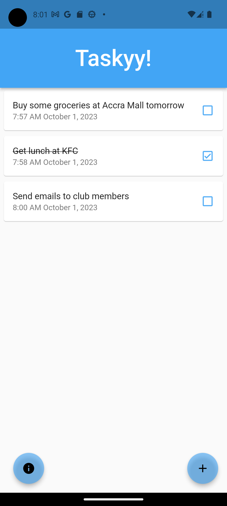

# Taskyy

A minimalist to-do app built with Flutter

## Project Details

- Used <a href="C:\Users\23350\Desktop\more stuff\Flutter Projects\Taskyy\taskyy">Hive</a> database to persist data in the app

## Screenshots

# Main Screen

View all tasks here
 
 

# Add a new task

Add a new task, data and time of addition of task will be displayed.
 
 

# How To

A guide on how to use the app
 
 

